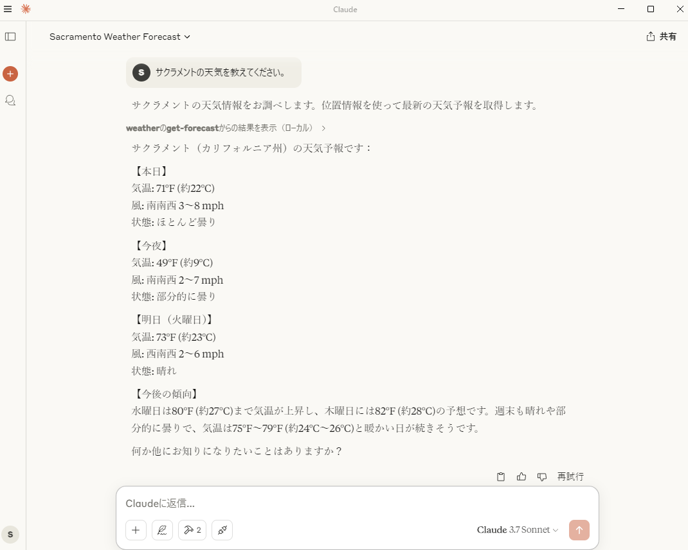

# MCPサーバーのチュートリアル実装

[公式のQuickStart](https://modelcontextprotocol.io/quickstart/server)をそのまま実装。  
Node.jsのバージョンは16以上を使用すること。

```
npm install
npx tsc
```

でビルド。Macは実行権限をつける。 `chmod 755 build/index.js`

## Claude Desktopでの設定

```
code $env:AppData\Claude\claude_desktop_config.json
```
で設定ファイルを開く。

以下のように設定。

```
{
  "mcpServers": {
      "weather": {
          "command": "node",
          "args": [
              "C:\\Users\\sifue\\workspace\\mcp-study\\build\\index.js"
          ]
      }
  }
}
```

設定後はClaude Desktopを再起動。

「サクラメントの天気を教えてください」

で検証。東京の天気は調べられないので要注意。



## VSCodeの設定
【未検証】いずれGitHub Copilot でAIエージェントが利用できるようなると利用できるらしい(現在はプレビュー版のみ)。
mcpで設定を検索して以下をsetting.jsonに設定。パスは適宜変更すること。jsonのweatherの上に起動ボタンが現れるので起動しておく。

```json
{
  "mcpServers": {
      "weather": {
          "command": "node",
          "args": [
              "C:\\Users\\sifue\\workspace\\mcp-study\\build\\index.js"
          ]
      }
  }
}
```

設定後はGitHub Copilotで

「サクラメントの天気を教えてください」

で検証。東京の天気は調べられないので要注意。

## 動作確認
詳しくは、[TypeScript SDK](https://github.com/modelcontextprotocol/typescript-sdk)のClientの実装を参照。

```
node build/index.js
```
でサーバーを起動。

```
node .\build\client.js
```
でクライアントを起動して実行。

クライアントは検証したいコードに合わせて書き換え、その後、
```
npx txc
```
でビルドして再度クライアントを実行する


## 参考
- [MCPのQuickStart](https://modelcontextprotocol.io/quickstart/server)
- [VSCodeのMCP設定](https://code.visualstudio.com/docs/copilot/chat/mcp-servers)